# Flowchart Sistem DBHC (Dashboard Kepegawaian Regional 1 PT Angkasa Pura Indonesia)

## 1. Alur Utama Sistem

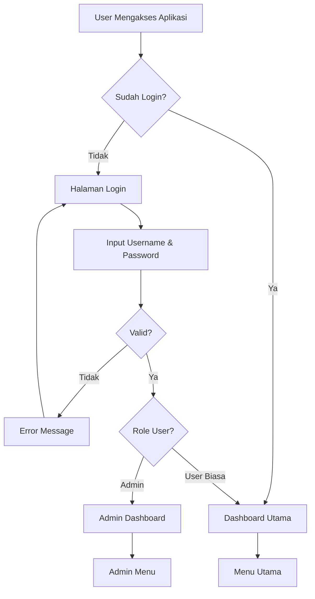

## 2. Struktur Menu dan Hak Akses

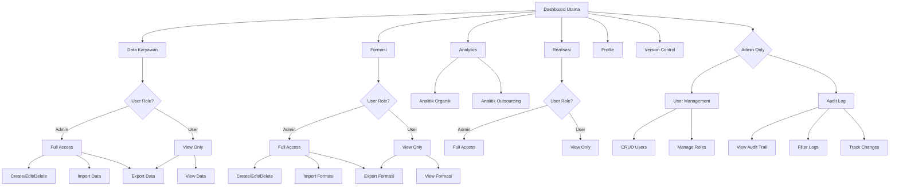

## 3. Alur Detail Dashboard

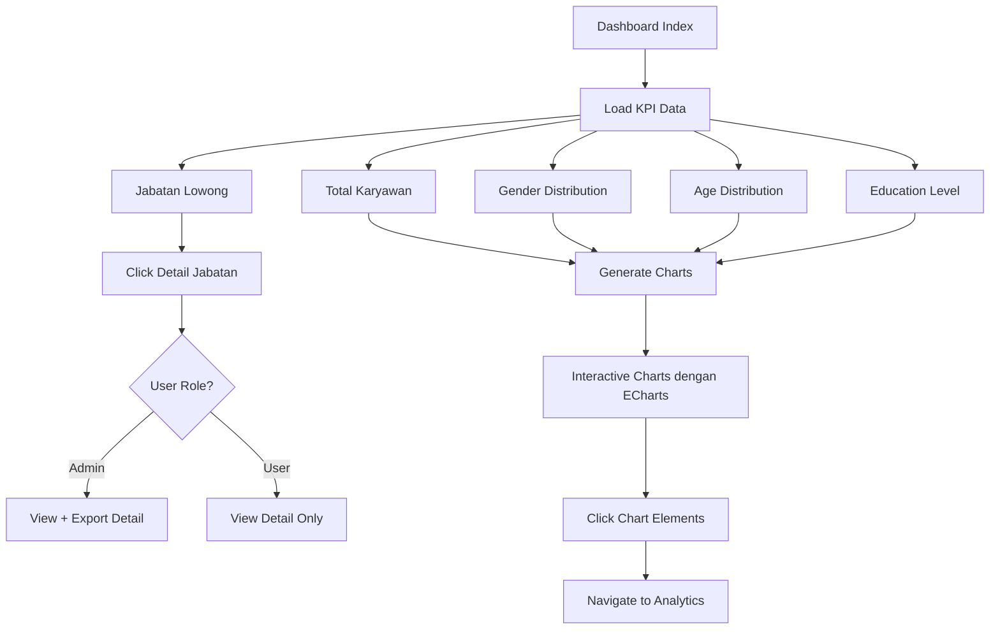

## 4. Alur Data Karyawan Management

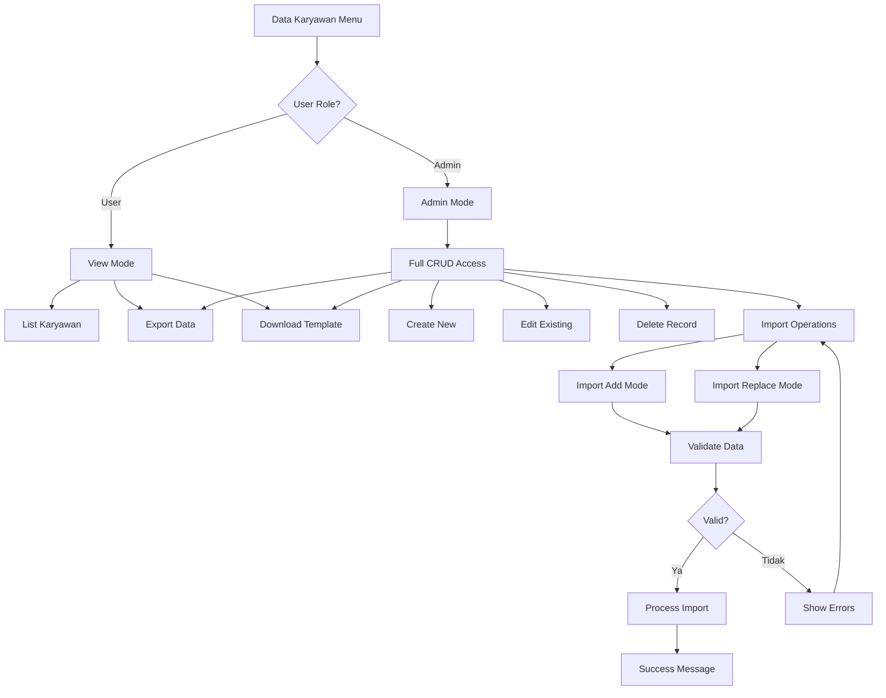

## 5. Alur Formasi Management

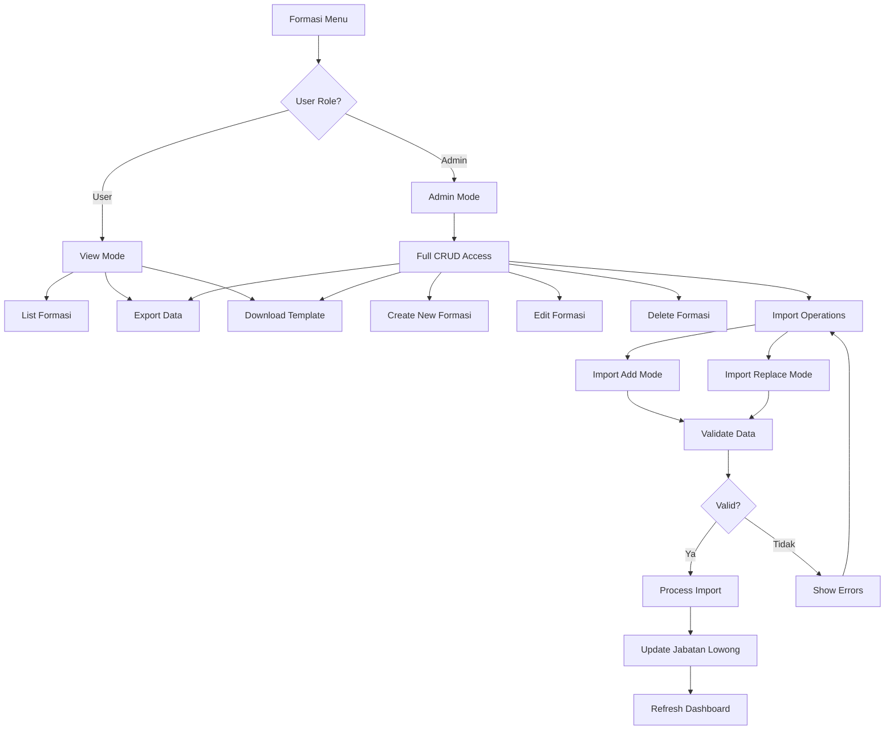

## 6. Alur Realisasi Management

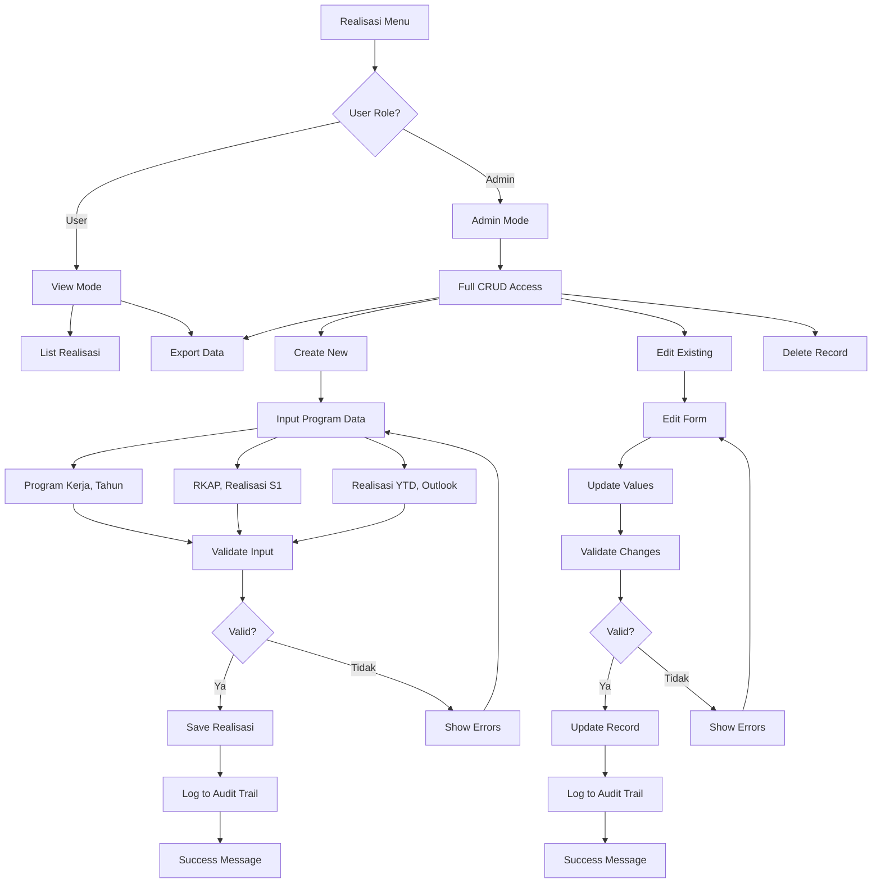

## 7. Alur Analytics System

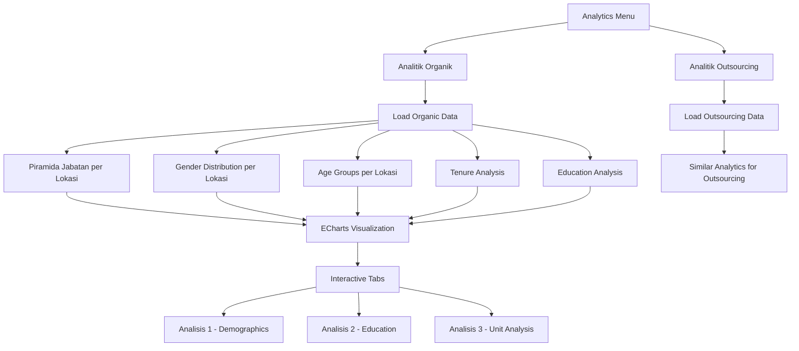
    G --> J
    H --> J
    I --> J
    
    J --> K[Interactive Tabs]
    K --> L[Analisis 1 - Demographics]
    K --> M[Analisis 2 - Education]
    K --> N[Analisis 3 - Unit Analysis]
    
    C --> O[Load Outsourcing Data]
    O --> P[Similar Analytics for Outsourcing]
```

## 7. Alur Version Control

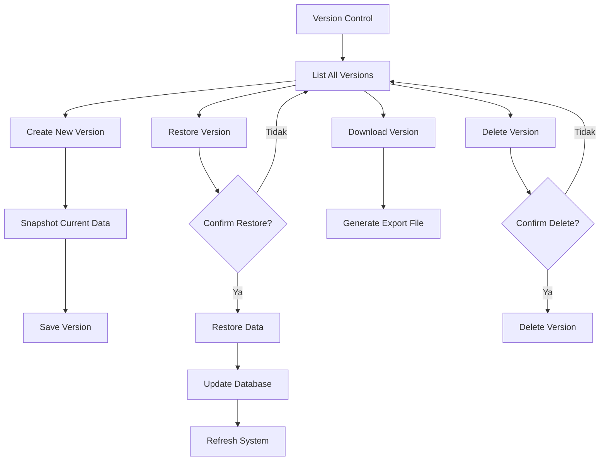

## 8. Alur User Management (Admin Only)

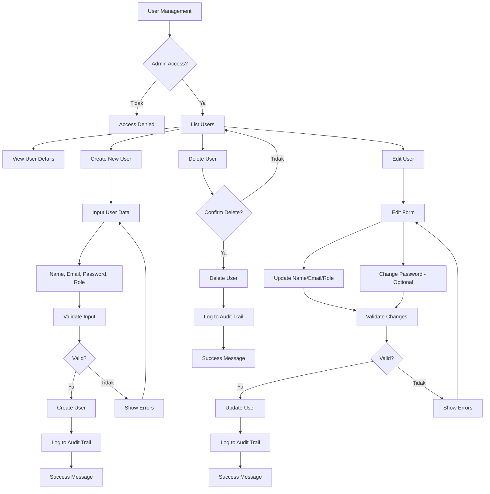

## 9. Alur Audit Log System

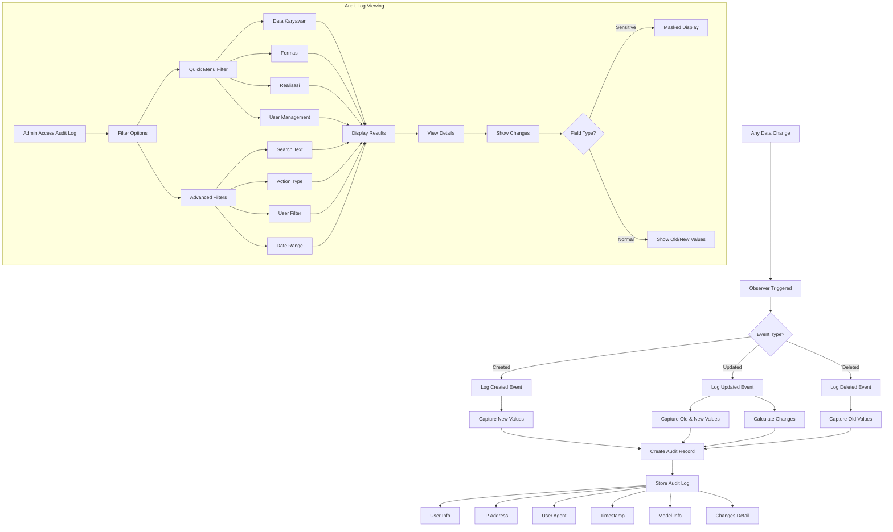

## 10. Alur Profile Management

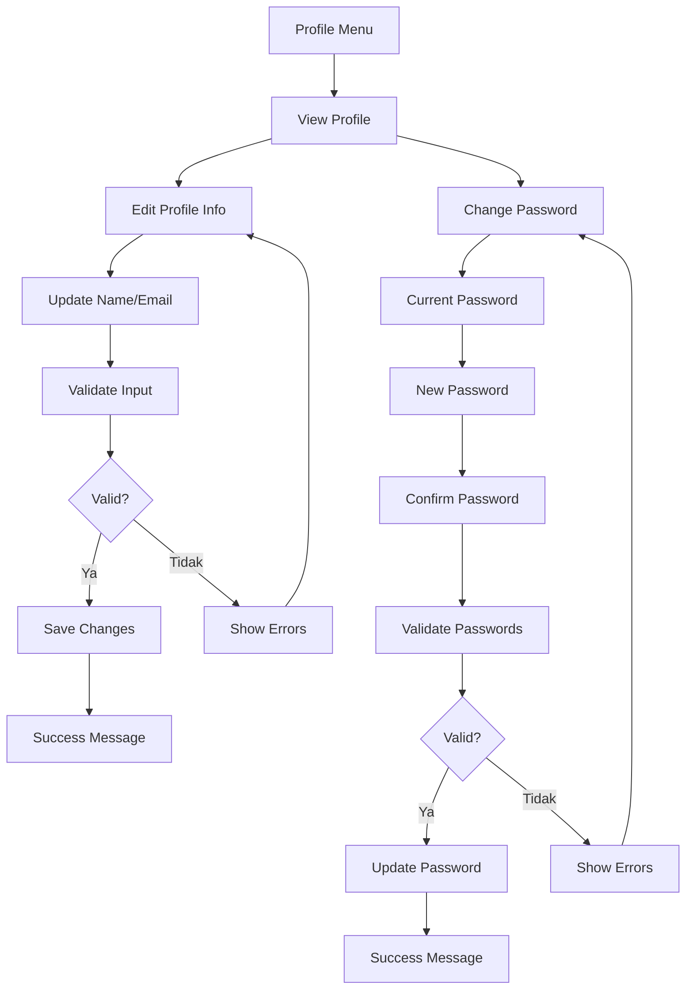

## 11. Security & Authentication Flow

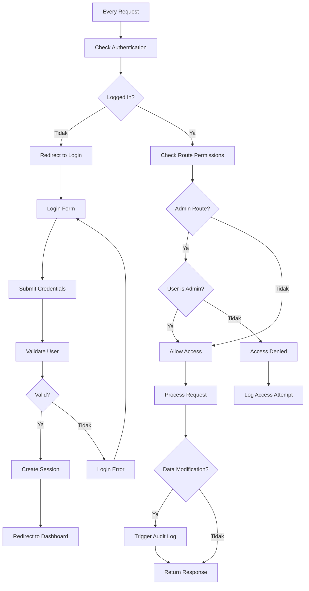

## 12. Data Flow Architecture

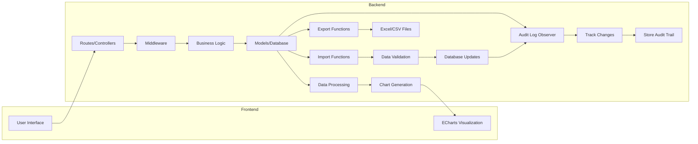

## Penjelasan Sistem:

### **Karakteristik Utama:**
1. **Role-based Access Control**: Admin vs User biasa
2. **Dashboard Interaktif**: Charts dengan ECharts
3. **Data Management**: CRUD operations untuk Karyawan, Formasi, Realisasi
4. **Analytics**: Detailed analysis untuk Organik vs Outsourcing
5. **Version Control**: Snapshot dan restore data
6. **Import/Export**: Excel/CSV processing dengan batch processing
7. **User Management**: Admin dapat mengelola user (Admin only)
8. **Audit Log System**: Automatic tracking semua perubahan data (Admin only)
9. **Security**: Multi-layer authentication & authorization

### **User Roles:**
- **Admin**: Full access - CRUD, Import, Export, Delete, User Management, Audit Log
- **User**: Read access - View, Export only

### **Core Features:**
- Dashboard dengan KPI dan charts interaktif
- Management data karyawan, formasi, dan realisasi
- Analytics mendalam (organik vs outsourcing)
- Version control untuk data backup/restore
- User management dengan role assignment
- Comprehensive audit trail system
- Profile management dengan password change
- Secure authentication system

### **Audit Log Features:**
- **Automatic Tracking**: Semua perubahan (Create, Update, Delete) tercatat otomatis
- **Detailed Information**:
  - User yang melakukan perubahan
  - Timestamp dengan presisi detik
  - IP Address dan User Agent
  - Nilai lama vs nilai baru (field-by-field)
  - Model identifier untuk identifikasi mudah
- **Advanced Filtering**:
  - Quick menu filter (Data Karyawan, Formasi, Realisasi, User)
  - Search text across multiple fields
  - Filter by action type (Created, Updated, Deleted)
  - Filter by user
  - Date range filtering
- **Security Features**:
  - Sensitive fields (password) ditampilkan tapi nilai di-mask
  - Admin-only access
  - Complete audit trail untuk compliance

### **Data Models dengan Audit:**
1. **DataKaryawan** - Employee data tracking
2. **Formasi** - Position formation tracking
3. **Realisasi** - Program realization tracking
4. **User** - User management tracking

### **Technical Stack:**
- **Backend**: Laravel 12, PHP 8.3
- **Database**: MySQL with audit_logs table
- **Frontend**: Blade Templates, Bootstrap 5, Alpine.js
- **Charts**: ECharts for interactive visualizations
- **Excel**: Maatwebsite Excel with batch processing
- **Authentication**: Laravel built-in + Spatie Permissions
- **Audit**: Custom trait-based observer pattern